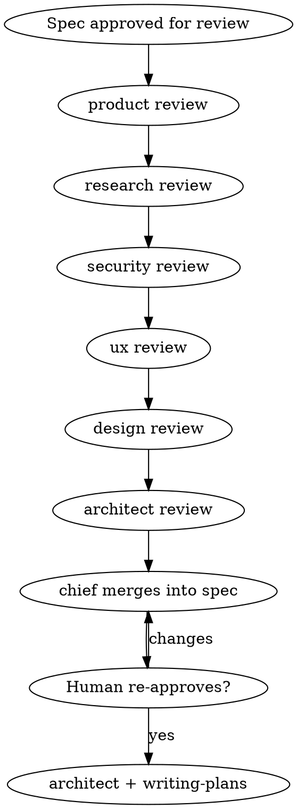

# Spec specialist review

Multi-role review gate between **brainstorming** (design spec) and **writing-plans** (implementation plan).

<HARD-GATE>
Do NOT invoke `writing-plans`, write implementation code, or start execution until:
1. This review pipeline completes (or roles are explicitly skipped with reason),
2. Findings are merged into the design spec,
3. The human re-approves the updated spec.
</HARD-GATE>

## When to use

Trigger when:

- Brainstorming saved `docs/superpowers/specs/YYYY-MM-DD-<topic>-design.md`, and
- The human approved the draft **for specialist review** (not yet for planning).

Invoke in Qwen Code:

```text
/superpowers:spec-specialist-review
```

Or ask the agent to follow this skill by name after spec approval.

## Context discipline (read first)

These rules prevent 32k context blow-ups (e.g. chief @ 32768 overflowing on monorepo globs):

1. **Model routing**
   - Architectural exploration, large codebase mapping, and synthesis → switch to **`architect`** (`/model architect` or ai-mode `architect` @ 131072) **before** broad reads.
   - **`chief`**, **`chat`**, and **`product`** (≤32k native on Qwen3-14B) are for dialogue and spec-sized work — not `**/*.js` sweeps or dumping tool transcripts.
   - Each specialist pass uses that role’s model when available (`ai-mode prompt <role>`).

2. **What to load**
   - Every pass: the **design spec file** + **targeted** excerpts (named paths, small reads, focused search).
   - NEVER glob entire trees (`**/*`, all JS files) into one request.
   - Summarize exploration **into the spec or review side-files**; do not retain huge search/read output in chat.

3. **Stop rule**
   - If the active session is on a ≤32k model and the next step needs wide exploration, **STOP** and tell the user to run `/model architect` (or load `architect` in ai-mode) before continuing.

## Pipeline

### 0. Confirm spec

- Verify the spec path exists and matches the topic under review.
- Record absolute path: `SPEC_PATH=docs/superpowers/specs/...-design.md`

### 1. Sequential review passes

Run in order. Skip a pass only with an explicit **N/A** reason in the output.

| Order | Role | When to skip |
| --- | --- | --- |
| 1 | `product` | Never for feature specs |
| 2 | `research` | No unknown APIs, competitors, or tech spikes in spec |
| 3 | `security` | Pure internal tooling with no auth/data/secrets (rare) |
| 4 | `ux` | No user-facing flows |
| 5 | `design` | No UI / visual surface |
| 6 | `architect` | Never for architectural specs — feasibility + plan readiness |

**Per pass:**

1. Switch/load model for that role if your environment supports it.
2. Load system guidance: `ai-mode prompt <role>` (or equivalent role prompt).
3. Read `SPEC_PATH` only plus **minimal** codebase context needed for that lens.
4. Emit a section:

```markdown
## <Role> review

### Blocking
- …

### Non-blocking
- …

### Proposed edits
- …
```

5. Optionally write the same section to:
   `docs/superpowers/specs/reviews/YYYY-MM-DD-<topic>-<role>.md`

### 2. Chief merge

**`chief`** (or the main orchestrator) reads all review sections and **merges** into `SPEC_PATH`:

- Resolve contradictions (note decisions in spec).
- Apply **Proposed edits** that the human would expect pre-plan.
- Keep blocking items visible in spec **Open questions / Risks** until resolved.

Do not invoke `writing-plans` during merge.

### 3. Human re-approval

Ask:

> "Specialist reviews merged into `<SPEC_PATH>`. Please re-approve the spec before we create the implementation plan."

If the human requests changes, update the spec and re-run only the affected review passes.

### 4. Hand off to planning

Only after re-approval:

- Switch to **`architect`** model.
- Invoke **`writing-plans`** (not `chief`, not `coder`).

```text
/superpowers:writing-plans
```

Architect owns the implementation plan; coder executes later via executing-plans / subagent flows.

## Flow diagram



## ai-mode integration

With `eval "$(ai-mode env)"` and dev-shop running:

```bash
ai-mode prompt product    # system prompt for product pass
ai-mode prompt architect  # use before large exploration or writing-plans
curl "$(ai-mode url)/chat/completions" ...  # model id = role name from dev-shop.ini
```

Role context budgets are documented in `presets/MODELS.md`. Prefer **`architect`** for any pass that needs more than ~24k tokens of combined spec + code excerpts.

## Principles

- **One lens at a time** — product does not threat-model; security does not rewrite UX copy unless security-relevant.
- **No implementation** — reviews improve the spec; they do not edit production code.
- **Blocking vs non-blocking** — blocking must be resolved or explicitly accepted by the human before `writing-plans`.
- **YAGNI** — do not expand scope during review; flag scope creep as non-blocking or blocking per product judgment.
